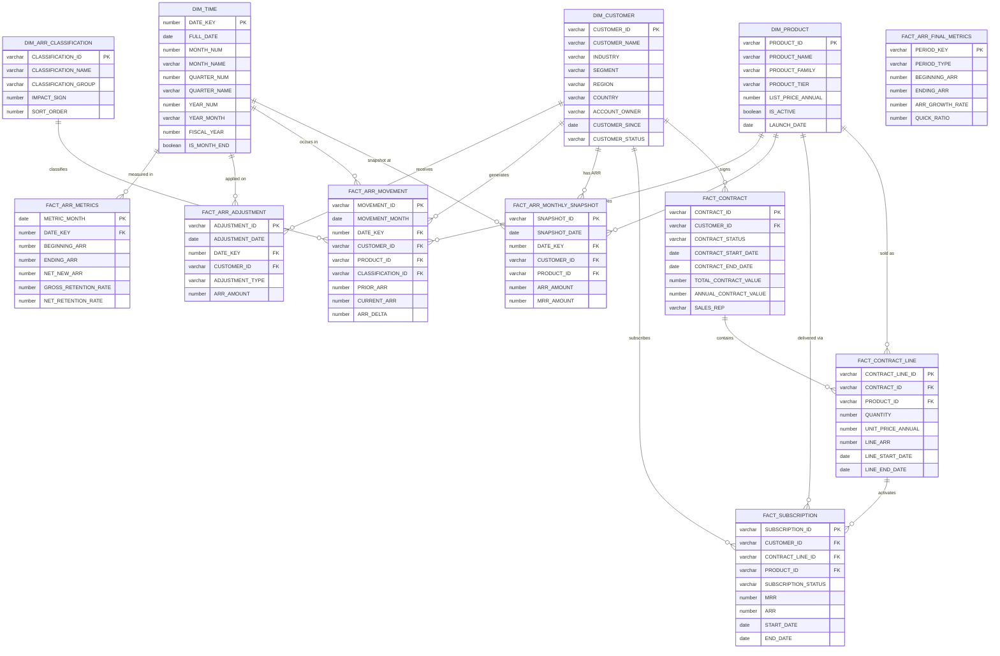

# ARR Semantic Model - Entity Relationship Diagram

## ER Diagram (Mermaid)



---

## Relationship Mapping

| From Table | To Table | FK Column | Cardinality | Description |
|------------|----------|-----------|-------------|-------------|
| FACT_CONTRACT | DIM_CUSTOMER | CUSTOMER_ID | Many:1 | Each contract belongs to one customer |
| FACT_CONTRACT_LINE | FACT_CONTRACT | CONTRACT_ID | Many:1 | Each line belongs to one contract |
| FACT_CONTRACT_LINE | DIM_PRODUCT | PRODUCT_ID | Many:1 | Each line is for one product |
| FACT_SUBSCRIPTION | DIM_CUSTOMER | CUSTOMER_ID | Many:1 | Each subscription serves one customer |
| FACT_SUBSCRIPTION | FACT_CONTRACT_LINE | CONTRACT_LINE_ID | Many:1 | Each subscription maps to one contract line |
| FACT_SUBSCRIPTION | DIM_PRODUCT | PRODUCT_ID | Many:1 | Each subscription delivers one product |
| FACT_ARR_MONTHLY_SNAPSHOT | DIM_CUSTOMER | CUSTOMER_ID | Many:1 | Snapshot attributed to one customer |
| FACT_ARR_MONTHLY_SNAPSHOT | DIM_PRODUCT | PRODUCT_ID | Many:1 | Snapshot for one product |
| FACT_ARR_MONTHLY_SNAPSHOT | DIM_TIME | DATE_KEY | Many:1 | Snapshot as of one date |
| FACT_ARR_MOVEMENT | DIM_CUSTOMER | CUSTOMER_ID | Many:1 | Movement from one customer |
| FACT_ARR_MOVEMENT | DIM_PRODUCT | PRODUCT_ID | Many:1 | Movement for one product |
| FACT_ARR_MOVEMENT | DIM_ARR_CLASSIFICATION | CLASSIFICATION_ID | Many:1 | Movement classified as one type |
| FACT_ARR_MOVEMENT | DIM_TIME | DATE_KEY | Many:1 | Movement in one period |
| FACT_ARR_ADJUSTMENT | DIM_CUSTOMER | CUSTOMER_ID | Many:1 | Adjustment for one customer |
| FACT_ARR_ADJUSTMENT | DIM_TIME | DATE_KEY | Many:1 | Adjustment in one period |
| FACT_ARR_METRICS | DIM_TIME | DATE_KEY | 1:1 | One metrics row per month |

---

## Table Purpose Summary

| # | Table | Type | Purpose |
|---|-------|------|---------|
| 1 | DIM_CUSTOMER | Dimension | Customer master - all account attributes |
| 2 | DIM_PRODUCT | Dimension | Product catalog - SKUs, pricing, families |
| 3 | DIM_TIME | Dimension | Calendar - dates, fiscal periods, flags |
| 4 | DIM_ARR_CLASSIFICATION | Dimension | Movement type lookup - standardized categories |
| 5 | FACT_CONTRACT | Fact | Signed agreements - lifecycle tracking |
| 6 | FACT_CONTRACT_LINE | Fact | Line items - product/pricing detail per contract |
| 7 | FACT_SUBSCRIPTION | Fact | Active services - MRR/ARR delivery tracking |
| 8 | FACT_ARR_MONTHLY_SNAPSHOT | Fact | Point-in-time ARR - monthly customer-product state |
| 9 | FACT_ARR_MOVEMENT | Fact | ARR changes - classified deltas (waterfall source) |
| 10 | FACT_ARR_ADJUSTMENT | Fact | Manual adjustments - FX, credits, corrections |
| 11 | FACT_ARR_METRICS | Fact | Pre-aggregated KPIs - monthly executive metrics |
| 12 | FACT_ARR_FINAL_METRICS | Fact | Strategic rollup - quarterly/annual board metrics |

---

## Data Flow

```
Customer signs → CONTRACT → has LINE ITEMS (per product)
                                    ↓
                            SUBSCRIPTION activated
                                    ↓
                     Monthly SNAPSHOT captures ARR state
                                    ↓
                    MOVEMENT computed (delta vs prior month)
                                    ↓
              Pre-aggregated → ARR METRICS (monthly)
                                    ↓
                        Rolled up → FINAL METRICS (quarterly/annual)

                    ADJUSTMENTS applied independently
                    (FX, credits, corrections)
```
